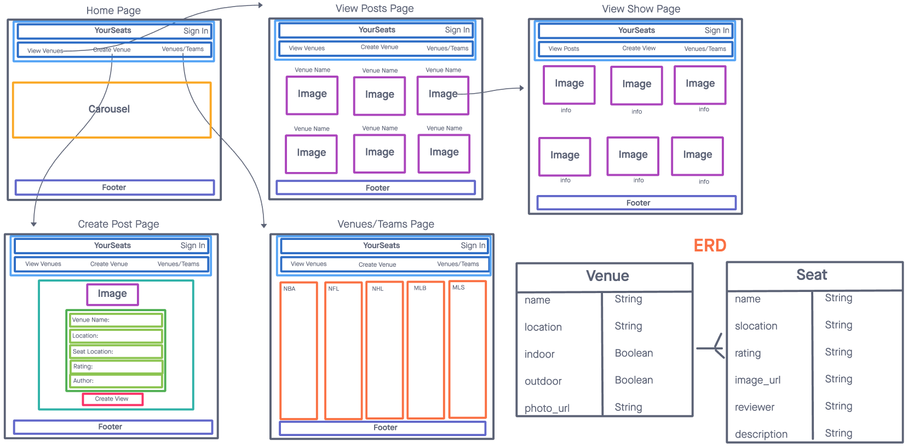

# YourSeat - Captsone Project

## Description:
Welcome to views from your seat rating app. The app is a full-stack app with full CRUD data operations. Backend was developed with Python and Django. Frontend was developed with React JS.

[Click Here](backendlink) to take a look at the backend code!

## Technologies Used:
- ReactJS
- Python/Django
- CSS
- HTML
- JavaScript
- Postico
- Netlify

## Screenshots:
These screenshots show a quick sketch of what the app looks while the user navigates through it.

## Get it Started:
[Click here](netlifylink) to check out the app!

## Future Enhancements:
For future enhacements, I would like to have filters to sort the reviews by the sport/venue.